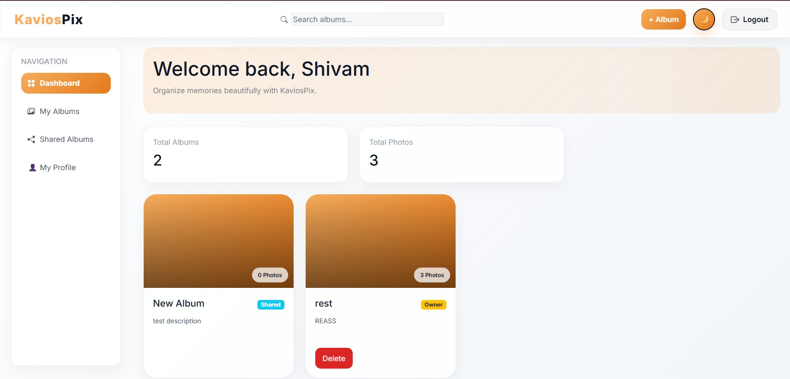
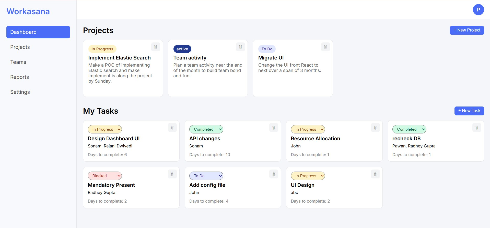
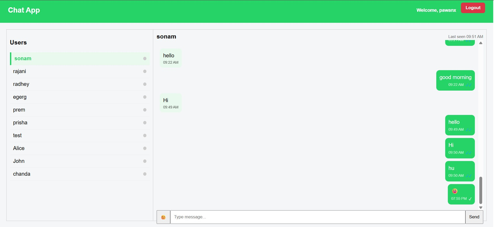

# Hi, I'm Pawan Mishra 👋

### Full Stack Developer | MERN | FastAPI | SQL

Building scalable web applications, backend systems, and real-time platforms.

[Portfolio](https://portfolio-pawanx.vercel.app) •
[LinkedIn](https://www.linkedin.com/in/pawan-mishra-08b3b9133/) •
[Email](mailto:pawanmishra196@gmail.com)

---

## 👨‍💻 About Me

Full Stack Developer with **3 years of software engineering experience** at IBS Software, building enterprise-grade solutions and modern web applications.

I specialize in:

- Building scalable MERN stack applications
- Designing REST APIs with FastAPI & Express
- Real-time systems with WebSockets
- Database-driven platforms using MongoDB & SQL
- Clean architecture & maintainable backend systems

---

## 🛠 Tech Stack

### Frontend

### Backend

### Database

### Tools
Git • GitHub • Postman • Jira • SVN • Vercel • Render

---

## 🚀 Featured Projects

### 📸 KaviosPix
Photo management platform with secure authentication and Cloudinary media hosting.

**Tech:** React, Node.js, MongoDB, JWT, Cloudinary

---

### 📌 WorkAsana
Project and task management platform with collaborative workflows.

**Tech:** MERN, JWT Authentication

---

### 💬 Chat App
Real-time messaging platform with live presence tracking.

**Tech:** MERN, WebSockets

---

## 💼 Professional Experience

### Software Engineer — IBS Software Pvt Ltd
**2015 – 2018**

- Resolved 50+ production issues
- Improved enterprise logistics systems
- Collaborated in Agile development teams
- Worked with Git, SVN, Jira

---

## 📊 GitHub Stats

---

## 🌱 Currently Learning

- Advanced FastAPI
- System Design
- Docker
- Redis
- Scalable backend architecture

---

## 📫 Let's Connect

- Portfolio: [My Portfolio Website](https://portfolio-pawanx.vercel.app)
- Email: [Click here to get in touch](mailto:pawanmishra196@gmail.com)
- LinkedIn: [Verified LinkedIn Profile](https://www.linkedin.com/in/pawan-mishra-08b3b9133/)
